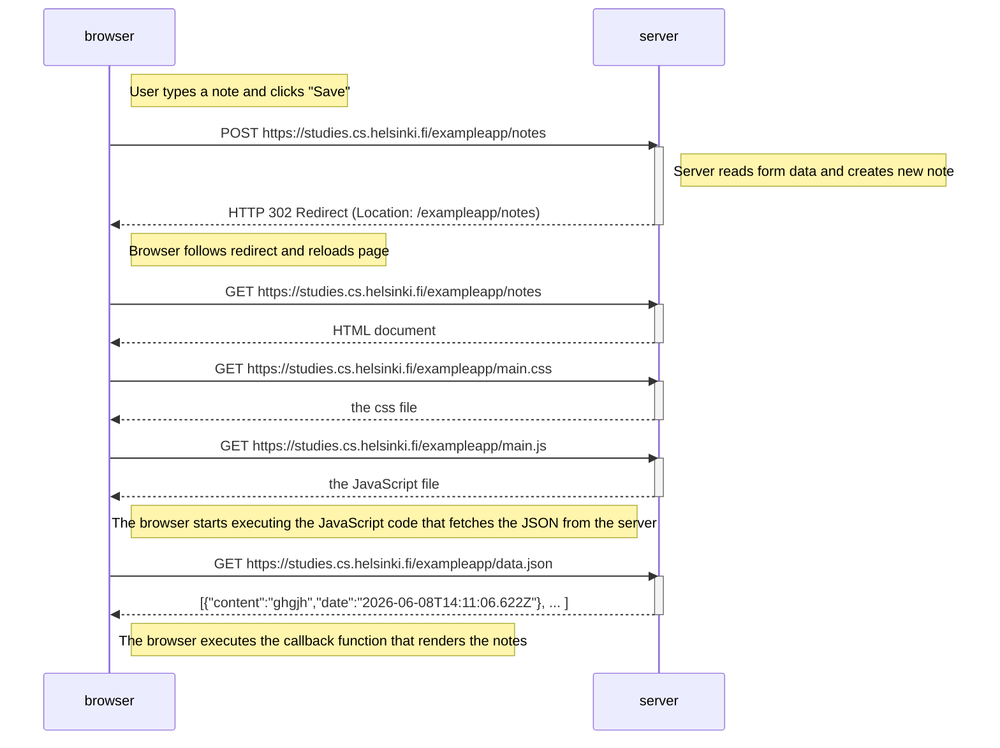

```mermaid 
sequenceDiagram
    participant browser
    participant server

    Note right of browser: User types a note and clicks "Save"

    browser->>server: POST https://studies.cs.helsinki.fi/exampleapp/notes
    activate server
    Note right of server: Server reads form data and creates new note
    server-->>browser: HTTP 302 Redirect (Location: /exampleapp/notes)
    deactivate server

    Note right of browser: Browser follows redirect and reloads page

    browser->>server: GET https://studies.cs.helsinki.fi/exampleapp/notes
    activate server
    server-->>browser: HTML document
    deactivate server

    browser->>server: GET https://studies.cs.helsinki.fi/exampleapp/main.css
    activate server
    server-->>browser: the css file
    deactivate server

    browser->>server: GET https://studies.cs.helsinki.fi/exampleapp/main.js
    activate server
    server-->>browser: the JavaScript file
    deactivate server

    Note right of browser: The browser starts executing the JavaScript code that fetches the JSON from the server

    browser->>server: GET https://studies.cs.helsinki.fi/exampleapp/data.json
    activate server
    server-->>browser: [{"content":"ghgjh","date":"2026-06-08T14:11:06.622Z"}, ... ]
    deactivate server

    Note right of browser: The browser executes the callback function that renders the notes
```