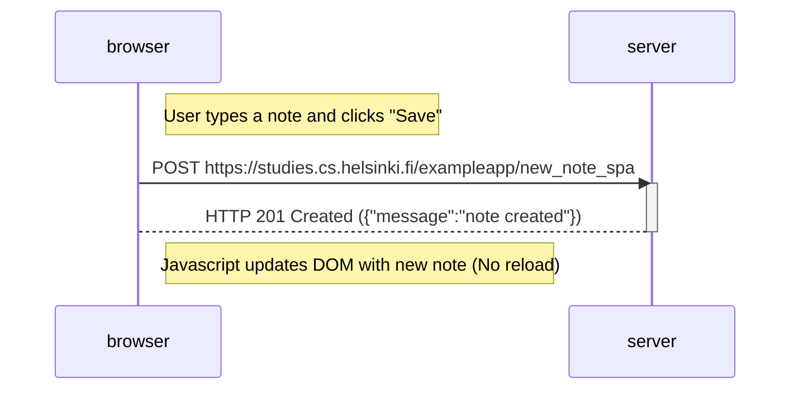

```mermaid
sequenceDiagram

participant browser
participant server

Note right of browser: User types a note and clicks "Save"

browser->>server: POST https://studies.cs.helsinki.fi/exampleapp/new_note_spa
activate server
server-->browser: HTTP 201 Created ({"message":"note created"})
deactivate server

Note right of browser: Javascript updates DOM with new note (No reload)
```